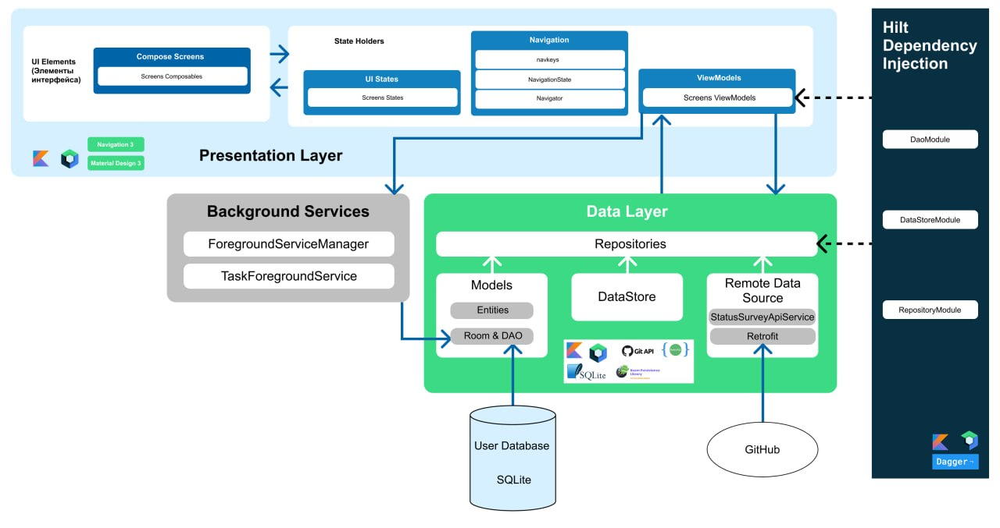

# Sanitly

**Sanitly** is an Android application for goal management and emotional state monitoring, developed as a diploma project.

The app allows users to set personal goals, break them down into tasks, and track progress. Based on completed tasks, the user can view productivity and mood statistics for the day, week, or month. A built-in diary lets users reflect on completed goals with personal notes.

---

## Features

- **Status Survey** — an onboarding psychological survey that assesses the user's initial emotional state. Questions and results are loaded from a remote GitHub-hosted JSON file via the GitHub API.
- **Goal Builder** — a multi-step flow to create a goal: name, category, deadline, description, and a list of tasks with estimated hours and difficulty.
- **Goal Tracker** — select a goal and work through its tasks one by one. A built-in timer measures actual time spent on each task; a foreground service keeps the timer running when the app is in the background.
- **Diary** — write personal notes (success, failure, summary) for completed goals to support self-reflection.
- **Analytics** — visual statistics for Day / Week / Month: completed tasks, total work time, average difficulty, average mood, productivity peak hour, active days percentage, and best/worst day.
- **Options** — configure app theme (System / Dark / Light), notification preferences (on/off, sound on/off), and view the app version.

---

## Architecture

The application follows **MVVM** (Model–View–ViewModel) with a clean layered architecture:

- **Presentation Layer** — Jetpack Compose screens, Navigation3 routing, ViewModels, and UI state classes.
- **Data Layer** — Room database (Goals, Questions), DataStore (user preferences), and a remote data source via Retrofit pointing at the GitHub API.
- **Background Services** — `TaskForegroundService` keeps the task timer alive in the background; `ForegroundServiceManager` manages its lifecycle.
- **Dependency Injection** — Hilt with three modules: `DaoModule`, `DataStoreModule`, `RepositoryModule`.



---

## Tech Stack

| Category | Technology |
|---|---|
| Language | Kotlin |
| UI | Jetpack Compose, Material Design 3 |
| Navigation | Jetpack Navigation3 |
| Async | Coroutines, Flow |
| Local DB | Room (SQLite) |
| Preferences | DataStore |
| Network | Retrofit, Gson |
| DI | Dagger Hilt |
| Background | Foreground Service |
| Testing | JUnit, MockK, Mockito, Robolectric |

---

## Project Structure

```
Sanitly/
├── app/
│   └── src/
│       ├── main/java/io/github/kobych/sanitly/
│       │   ├── SanitlyApplication.kt        # Application class, Hilt entry point, notification channels
│       │   ├── MainActivity.kt              # Single activity, theme switching, permission requests
│       │   ├── data/
│       │   │   ├── database/
│       │   │   │   ├── UserDatabase.kt      # Room database singleton
│       │   │   │   ├── ListConverter.kt     # Gson TypeConverters for Room
│       │   │   │   ├── entities/            # Goal, Task, Question, Answer
│       │   │   │   └── dao/                 # GoalDao, QuestionDao
│       │   │   ├── di/                      # DaoModule, DataStoreModule, RepositoryModule
│       │   │   ├── repositories/            # 7 repository classes
│       │   │   ├── GitHubClient.kt          # Retrofit instance (GitHub API)
│       │   │   └── network/                 # StatusSurveyApiService
│       │   ├── model/                       # API response data classes
│       │   ├── navkeys/                     # Type-safe navigation keys
│       │   ├── ui/
│       │   │   ├── navigation/              # Navigator, NavigationState
│       │   │   ├── viewmodels/              # 7 ViewModel classes
│       │   │   ├── models/                  # Sealed UI state classes
│       │   │   ├── screens/                 # 20 Compose screen files
│       │   │   ├── components/              # Reusable Compose components
│       │   │   ├── managers/                # ForegroundServiceManager
│       │   │   ├── services/                # TaskForegroundService
│       │   │   └── theme/                   # Color, Type, Theme, Dimens, Size, Elevation
│       │   └── util/                        # DateFormat
│       ├── test/                            # Unit tests (repositories + viewmodels)
│       └── androidTest/                     # Instrumentation tests
├── resources/
│   └── strings.json                         # Survey questions/results (fetched via GitHub API)
└── README.md
```

---

## Getting Started

1. Clone the repository.
2. Open in Android Studio (Hedgehog or newer).
3. Set the `GITHUB_TOKEN` property in your `local.properties` file:
   ```
   GITHUB_TOKEN=your_personal_access_token
   ```
4. Build and run on an emulator or device with **API 26+**.

---

## Testing

The project includes unit tests for all repositories and ViewModels using JUnit, MockK, and Mockito, with a custom `MainDispatcherRule` for coroutine testing.

```
./gradlew test
```
